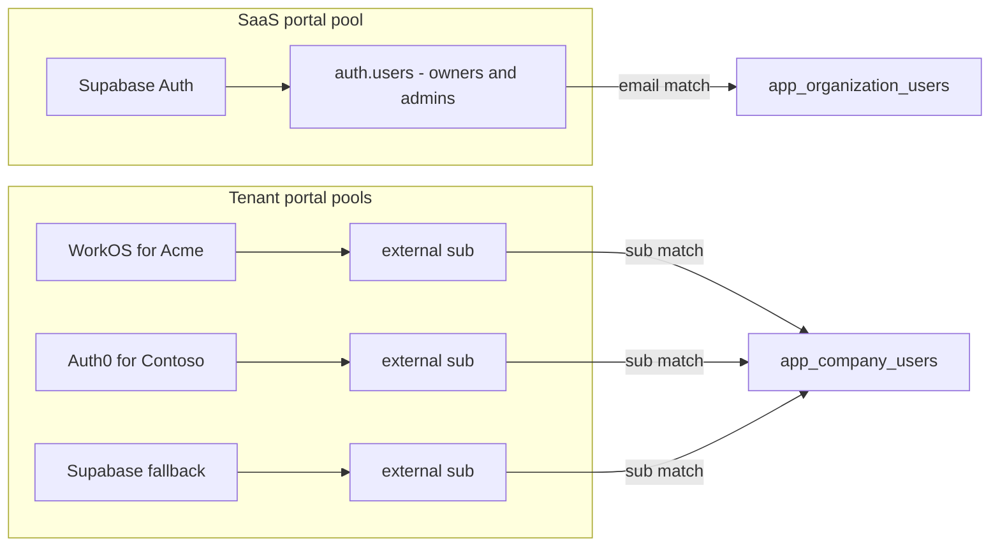
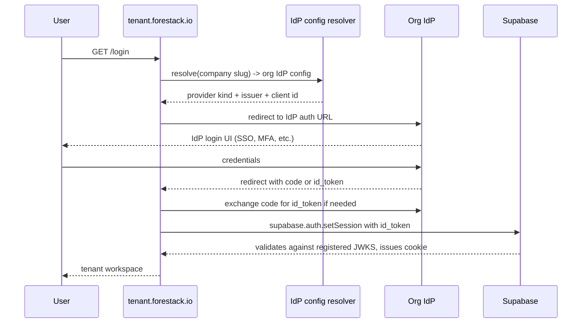

# Split auth: SaaS on Supabase, company users on per-org IdP

Status: **design / roadmap only**. Not implemented. The SaaS gate we already
shipped (custom-claims-based `saas_orgs` on the access token) is a strict
prerequisite for this work and is already live.

## Why this exists

Today every identity - SaaS owners, SaaS admins, company workers - lives in
the same `auth.users` pool. The SaaS portal is a paid product; the company
(tenant) portals are used by each org's workforce. That creates three
pressures this doc addresses:

1. **Billing clarity.** The number of paying SaaS accounts should not be
   inflated by company users who only ever touch a tenant subdomain.
2. **Enterprise controls.** Orgs want to plug their own IdP into their
   tenant portal (SAML SSO, MFA enforcement, domain allowlists, HR-driven
   lifecycle). A shared Supabase pool can't express that.
3. **Separation of blast radius.** A credential leak on a company portal
   should not grant anything on the SaaS side and vice versa.

The proposed target: **SaaS portal keeps using Supabase Auth. Tenant
portals use a per-org IdP (WorkOS for SSO/SAML, Auth0, Clerk, or a
Supabase fallback for orgs that don't configure one).**

Supabase's [Third-Party Auth](https://supabase.com/docs/guides/auth/third-party/overview)
feature is the hinge that makes this cheap: Supabase validates JWTs from
registered external issuers against their JWKS, so we don't need a custom
broker. One Postgres, one RLS model, two identity sources.

## Identity boundary



Key implication: an org owner who is also a worker at one of their own
companies would have **two separate logins**. This is deliberate - the
billable SaaS pool never contains company users.

## Data model deltas

### `app_company_users`
New columns:
- `external_subject_id text` - the IdP's `sub` claim.
- `external_issuer text` - the `iss` URL, so we can distinguish providers.
- `email text` remains for display and invite reconciliation only (no
  longer used for auth matching).

Add a unique index on `(external_issuer, external_subject_id)`.

### New table: `app_organization_identity_providers`
- `organization_id uuid references app_organizations(id)`
- `provider_kind enum ('workos','auth0','clerk','supabase_fallback')`
- `issuer_url text`
- `jwks_url text`
- `config jsonb` - client ids, connection ids, redirect uris
- `allowed_email_domains text[]` - optional domain allowlist
- `is_primary boolean` - exactly one primary per org

### Supabase dashboard side
For each provider you plan to support:
1. Authentication > Third-Party Auth > Add provider.
2. Supabase validates tokens against the provider's JWKS.
3. `auth.uid()` is then populated from `sub` + `iss`, and `auth.jwt()` has
   the provider's claims available to RLS.

## RLS split via an `auth_source()` helper

```sql
create or replace function public.auth_source()
returns text
language sql
stable
as $$
  select case
    when (auth.jwt()->>'iss') like '%supabase.co/auth/v1%' then 'saas'
    else 'tenant'
  end;
$$;
```

Every existing policy gets tightened. Two representative examples:

```sql
-- SaaS side: only Supabase-issued tokens can match owner/admin rows.
drop policy if exists "org_select_saas_members" on public.app_organizations;
create policy "org_select_saas_members" on public.app_organizations
  for select to authenticated
  using (
    public.auth_source() = 'saas'
    and id in (select public.my_org_ids())
  );

-- Tenant side: only external-issuer tokens can match company rows.
drop policy if exists "company_users_self" on public.app_company_users;
create policy "company_users_self" on public.app_company_users
  for select to authenticated
  using (
    public.auth_source() = 'tenant'
    and external_subject_id = auth.jwt()->>'sub'
    and external_issuer = auth.jwt()->>'iss'
  );
```

This is the hinge: a SaaS token cannot satisfy a tenant policy and vice
versa, even if the database were otherwise permissive.

## Tenant login sequence



## Files this will touch

- [src/lib/providers/tenant.ts](../../src/lib/providers/tenant.ts) - add
  `loadOrgIdP(slug)` and drive the login redirect decision.
- [src/routes/_companyPortal/$companySlug/login.tsx](../../src/routes/_companyPortal/)
  becomes a dispatcher that routes to the configured provider.
- New [src/routes/_companyPortal/$companySlug/auth/callback.tsx](../../src/routes/_companyPortal/) that
  exchanges the provider's code, hands the token to `setSession`, and
  redirects into the workspace.
- [src/routes/_saasPortal/_authed.tsx](../../src/routes/_saasPortal/_authed.tsx)
  gains a belt-and-suspenders `if (auth_source !== 'saas')` check; the
  primary defence stays in RLS.
- New org admin route: "Authentication" tab with an IdP picker + config
  wizard. One adapter file per provider
  (`src/features/saas/idp-adapters/{workos,auth0,clerk}.ts`).

## Migration plan for existing company users

Current state: all COMPANY-role users live in `app_organization_users` with
email-based auth. They log in via Supabase with the same pool as owners.

Target state: COMPANY-role entries move to `app_company_users` with an
`external_subject_id`/`external_issuer`, and they no longer authenticate
via the Supabase pool.

Proposed rollout, one org at a time:

1. Add the new columns as nullable. Deploy but do not flip any org yet.
2. Register the chosen IdP (e.g. WorkOS) in Supabase's Third-Party Auth
   and record its issuer URL in `app_organization_identity_providers`
   with `is_primary = true` for the pilot org.
3. First time each existing COMPANY user logs in via the new IdP, a
   one-time JIT hook upserts `external_subject_id`/`external_issuer`
   onto their row, matched by email.
4. Once all users of the org have migrated (or a cutoff date passes),
   revoke their Supabase password (or delete the `auth.users` entry) so
   the only way in is via the new IdP.
5. Repeat per-org. Orgs that never configure an IdP keep using the
   Supabase fallback provider.

## Effort bands

- Schema + RLS rework: **2-3 days**
- Supabase third-party provider wiring for one provider: **2-3 days**
- Tenant login/callback/dispatch: **2-3 days**
- Per-org IdP config UI + admin flow: **3-5 days**
- Each additional provider adapter (Auth0, Clerk): **+2-3 days**
- Testing against real IdPs, edge cases (JIT provisioning, sub rotation,
  disabled users, role changes mid-session): **3-5 days**

Ship-one-provider MVP: **~2 weeks**. Polished 3-provider story with
admin UI: **4-6 weeks**.

## Prerequisites

- Path A (already done): `saas_orgs` claim on access tokens and
  per-org route gate. Path B assumes this is in place.
- A customer or internal commitment concrete enough to pick the first
  IdP. WorkOS is the strongest default because it covers SAML/OIDC SSO
  for enterprise buyers behind a single integration.

## What this does NOT solve on its own

- Billing. Once COMPANY users leave the Supabase pool, we need a
  separate counter in the `app_organization_users` table for "paying
  SaaS seats". That's a small schema addition but must ship together
  with Path B to avoid accidental overcounts.
- SCIM / directory sync. Most enterprise buyers also want their IdP to
  provision/deprovision users automatically. That's an add-on, not part
  of this core split.
- Audit logs. Each IdP exposes logs in a different shape; centralising
  them is a separate project.
