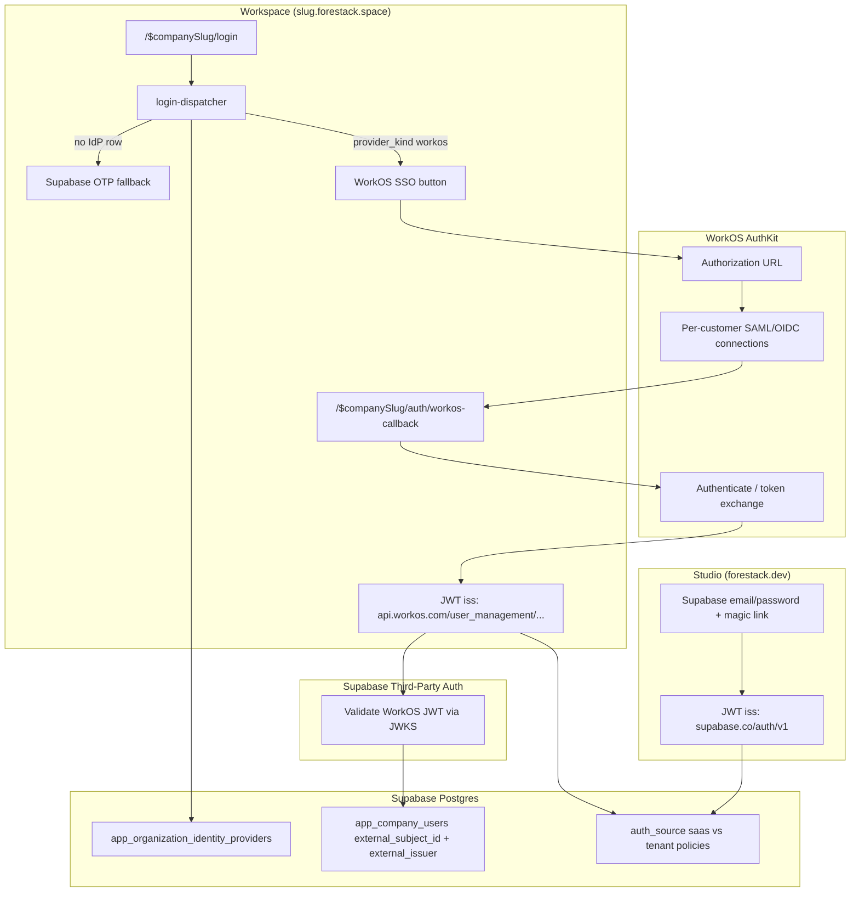

# WorkOS auth — workspace implementation plan

Status: **scaffolded (stubs compile; no credentials required)**. Studio stays on
Supabase Auth. Workspace will adopt per-org WorkOS SSO via Supabase Third-Party
Auth when credentials and schema land.

Authoritative dual-pool architecture:
[split-auth-per-org-idp.md](./split-auth-per-org-idp.md).

## Decision: AuthKit + Third-Party Auth (not standalone SSO, not Supabase OAuth)

| Option | Verdict | Why |
| ------ | ------- | --- |
| **Supabase built-in WorkOS OAuth** (`signInWithOAuth({ provider: 'workos' })`) | Reject for tenant pool | Issues **Supabase-issued** JWTs (`iss` = `*.supabase.co/auth/v1`). Breaks `auth_source()` RLS split — company users would remain in the SaaS pool. |
| **WorkOS standalone SSO API** | Reject for MVP | Lower-level middleware; you own user DB, session, and callback exchange. More code for the same SAML/OIDC outcome. |
| **WorkOS AuthKit API + Supabase Third-Party Auth** | **Chosen** | Official integration path ([Supabase WorkOS guide](https://supabase.com/docs/guides/auth/third-party/workos), [WorkOS AuthKit + Supabase](https://workos.com/docs/integrations/supabase-authkit)). Enterprise SSO, Admin Portal for customer IdP setup, JWT `iss` = `https://api.workos.com/user_management/<client_id>` so tenant RLS works. |

AuthKit issues **access tokens** (not classic Supabase refresh cookies). Supabase
validates them against WorkOS JWKS (via OIDC discovery). The app passes tokens
via the Supabase client's `accessToken` option (browser) or an SSR cookie adapter
(server) — see Phase 2 below.

## Architecture



## Auth flow (login → WorkOS → callback → Supabase session)

```mermaid
sequenceDiagram
    participant U as User
    participant W as Workspace app
    participant R as resolve-org-idp
    participant WO as WorkOS AuthKit
    participant IdP as Customer IdP
    participant CB as workos-callback route
    participant S as Supabase API

    U->>W: GET /login (tenant subdomain)
    W->>R: resolveOrgIdp(organizationId)
    alt No WorkOS IdP configured
        R-->>W: null
        W-->>U: Magic-link form (existing LoginForm)
    else WorkOS primary IdP
        R-->>W: WorkOSConnectionConfig
        U->>W: Click "Sign in with SSO"
        W->>WO: GET authorization URL (org/connection from config)
        WO-->>U: Redirect to customer IdP
        U->>IdP: SSO credentials + MFA
        IdP-->>WO: SAML/OIDC assertion
        WO-->>CB: Redirect ?code=...&state=...
        CB->>WO: POST authenticate (authorization_code)
        WO-->>CB: access_token (+ refresh_token)
        Note over CB,S: Phase 2: store token in httpOnly cookie;<br/>createClient({ accessToken }) on server
        CB->>S: API requests with Bearer WorkOS access_token
        S-->>CB: JWKS-validated; auth.jwt() has WorkOS claims
        CB-->>U: Redirect to /dashboard
    end
```

### JWT template (WorkOS dashboard)

Supabase RLS expects `role: "authenticated"`. Configure in WorkOS →
Authentication → Sessions → JWT Template:

```json
{
  "role": "authenticated",
  "user_role": {{organization_membership.role}}
}
```

Issuer URL for Supabase Third-Party Auth registration:

```txt
https://api.workos.com/user_management/<WORKOS_CLIENT_ID>
```

Use your custom auth domain instead of `api.workos.com` if configured.

## Folder / file tree (scaffolded)

```
apps/workspace/src/
  config/
    identity-providers.ts          # ProviderKind enum, constants, feature flags

  lib/auth/
    tenant-context.ts              # + external_subject_id matching stub
    workos/
      config.ts                    # Env validation, isWorkOsConfigured()
      types.ts                     # WorkOSConnectionConfig, token shapes
      resolve-org-idp.ts           # loadOrgIdP(organizationId) — DB stub
      get-authorization-url.ts     # createServerFn — build AuthKit auth URL
      handle-callback.ts           # createServerFn — code → tokens
      redirect-uri.ts              # Per-tenant callback URL builder
      index.ts                     # Barrel exports

  routes/$companySlug/
    login.tsx                      # Uses LoginDispatcher
    auth/
      confirm.tsx                  # Existing magic-link callback (unchanged)
      workos-callback.tsx          # New WorkOS OAuth callback route

  features/company/
    login-portal.tsx               # Existing magic-link form (unchanged)
    auth/
      login-dispatcher.tsx         # IdP vs magic-link routing
      workos-login-button.tsx      # SSO button UI stub

docs/roadmap/
  workos-workspace-implementation-plan.md   # This file
  split-auth-per-org-idp.md                 # + cross-link to this plan

.env.example                                # WorkOS env placeholders
AGENTS.md                                   # Brief WorkOS scaffold pointer
.cursor/skills/forestack-project/SKILL.md   # Brief WorkOS scaffold pointer
```

Future (not scaffolded yet):

```
apps/workspace/src/lib/datasource/supabase/tenant-client.ts  # accessToken from cookie
packages/shared/src/lib/data/auth/workos-jit.ts              # JIT upsert external_subject_id
apps/studio/src/features/saas/idp-adapters/workos.ts         # Org admin IdP wizard
```

## Environment variables

| Variable | Where | Required | Purpose |
| -------- | ----- | -------- | ------- |
| `WORKOS_API_KEY` | server only | yes (when live) | WorkOS API authentication for token exchange |
| `WORKOS_CLIENT_ID` | server (+ client later) | yes (when live) | AuthKit client id; part of Supabase issuer URL |
| `WORKOS_AUTH_DOMAIN` | server | no | Custom auth domain (default `api.workos.com`) |
| `WORKOS_REDIRECT_URI` | server | no | Override callback URL; default derived per tenant: `https://{slug}.forestack.space/auth/workos-callback` |
| `WORKOS_AUTH_ENABLED` | server | no | Feature flag (`true`/`1`); scaffold defaults to off until env + IdP row exist |

Existing vars unchanged: `VITE_SUPABASE_URL`, `VITE_SUPABASE_PUBLISHABLE_KEY`,
`TENANT_HOST`, `DEV_HOST`.

Cloudflare: `wrangler secret put WORKOS_API_KEY` (and other server vars) in
`apps/workspace` only — not studio.

## Database schema changes

From [split-auth-per-org-idp.md](./split-auth-per-org-idp.md). Not migrated yet.

### `app_company_users` (alter)

| Column | Type | Notes |
| ------ | ---- | ----- |
| `external_subject_id` | `text` | IdP `sub` claim |
| `external_issuer` | `text` | IdP `iss` URL |
| `email` | `text` | Display + JIT reconciliation only |

Unique index: `(external_issuer, external_subject_id)`.

### `app_organization_identity_providers` (new)

| Column | Type | Notes |
| ------ | ---- | ----- |
| `organization_id` | `uuid` FK → `app_organizations` | |
| `provider_kind` | `enum` | `workos`, `auth0`, `clerk`, `supabase_fallback` |
| `issuer_url` | `text` | e.g. `https://api.workos.com/user_management/client_xxx` |
| `jwks_url` | `text` | Optional; Supabase discovers via OIDC |
| `config` | `jsonb` | `workos_organization_id`, `connection_id`, redirect overrides |
| `allowed_email_domains` | `text[]` | Optional |
| `is_primary` | `boolean` | One primary per org |

Example `config` for WorkOS:

```json
{
  "workos_organization_id": "org_01H...",
  "connection_id": null,
  "login_hint_domains": ["acme.com"]
}
```

### RLS helper

`auth_source()` returns `saas` vs `tenant` based on JWT `iss` — see roadmap doc.

## MVP phases

### Phase 0 — Scaffold (this PR) ✅

- [x] Plan doc with architecture and flows
- [x] Compiling TypeScript stubs under `apps/workspace/src/lib/auth/workos/`
- [x] `workos-callback` route, login dispatcher, SSO button stub
- [x] `.env.example` placeholders
- [x] `requireCompanyAccess` external-identity matching stub (feature-flagged)
- [x] `npm run build:workspace` + `tsc --noEmit` pass

### Phase 1 — Credentials + dashboard wiring

- [ ] Create WorkOS account; copy Client ID + API Key
- [ ] WorkOS → Configuration → Redirect URIs:
  - `https://<slug>.forestack.space/auth/workos-callback` (prod)
  - `http://<slug>.localhost:3001/auth/workos-callback` (dev)
- [ ] WorkOS → JWT Template (`role: authenticated`)
- [ ] Supabase → Authentication → Third-Party Auth → Add WorkOS issuer URL
- [ ] Set `WORKOS_*` in `.env.local` and Cloudflare secrets
- [ ] Implement `handle-callback` token exchange (fetch to AuthKit authenticate)
- [ ] Store access token in httpOnly cookie; wire SSR `accessToken` adapter

### Phase 2 — Per-org IdP + membership

- [ ] Migration: `app_organization_identity_providers` + `app_company_users` columns
- [ ] Implement `resolveOrgIdP` query
- [ ] `requireCompanyAccess` match on `external_subject_id` + `external_issuer`
- [ ] JIT hook: first SSO login upserts company user by email
- [ ] RLS policies + `auth_source()` deploy

### Phase 3 — Admin UX + rollout

- [ ] Studio "Authentication" tab + WorkOS Admin Portal embed
- [ ] Per-org pilot migration (magic link → SSO cutoff)
- [ ] `@workos-inc/authkit-js` browser client (optional; reduces custom cookie code)

## When WorkOS account is ready — setup checklist

1. **WorkOS dashboard**
   - Enable AuthKit + SSO
   - Note **Client ID** and **API Key** (Configuration → API Keys)
   - Add redirect URIs for each environment (see Phase 1)
   - Set JWT template with `role: "authenticated"`
   - Create a test Organization + Connection (or use Admin Portal)

2. **Supabase dashboard** (project `ocisdaeugliixyhcjnkv`)
   - Authentication → Third-Party Auth → Add provider
   - Issuer: `https://api.workos.com/user_management/<WORKOS_CLIENT_ID>`
   - Do **not** enable WorkOS under Sign-in Providers (that path uses the Supabase pool)

3. **Forestack env**
   - Add vars to `.env.local` (see table above)
   - `wrangler secret put` for workspace worker

4. **Database**
   - Run schema migration from roadmap
   - Insert pilot row in `app_organization_identity_providers` for test org

5. **Verify**
   - Login dispatcher shows SSO button for pilot org
   - Complete SSO → callback → dashboard
   - `auth.jwt()->>'iss'` is WorkOS issuer on tenant routes
   - SaaS studio login still uses Supabase issuer

## What stays stubbed until credentials exist

| File | Stub behavior |
| ---- | ------------- |
| `config.ts` | `isWorkOsConfigured()` → false when env missing |
| `get-authorization-url.ts` | Throws `WorkOS is not configured` |
| `handle-callback.ts` | Throws `WorkOS is not configured` |
| `resolve-org-idp.ts` | Returns `null` (table not queried yet) |
| `workos-login-button.tsx` | Hidden when IdP null or WorkOS not configured |
| `login-dispatcher.tsx` | Falls through to magic-link `LoginForm` |
| `requireCompanyAccess` | Email match only; external match behind `WORKOS_AUTH_ENABLED` |

## Redirect URI reference

| Environment | Pattern |
| ----------- | ------- |
| Local dev | `http://{slug}.localhost:3001/auth/workos-callback` |
| Production | `https://{slug}.forestack.space/auth/workos-callback` |

`state` parameter should encode `companySlug` + `next` path (CSRF-safe relative redirect).

## Known integration notes

- Supabase validates WorkOS JWTs via OIDC discovery (`jwks_uri` may differ from
  issuer path). If you see `JWSInvalidSignature`, confirm Third-Party Auth
  issuer matches WorkOS docs and JWT template is applied.
- WorkOS `sub` in access token maps to `external_subject_id`; `iss` to
  `external_issuer` for `app_company_users` membership checks.
- Studio (`apps/studio`) is **out of scope** — no WorkOS files there.

## References

- [Supabase — WorkOS Third-Party Auth](https://supabase.com/docs/guides/auth/third-party/workos)
- [WorkOS — Supabase + AuthKit](https://workos.com/docs/integrations/supabase-authkit)
- [WorkOS — AuthKit SSO](https://workos.com/docs/authkit/sso)
- [Forestack split-auth roadmap](./split-auth-per-org-idp.md)
